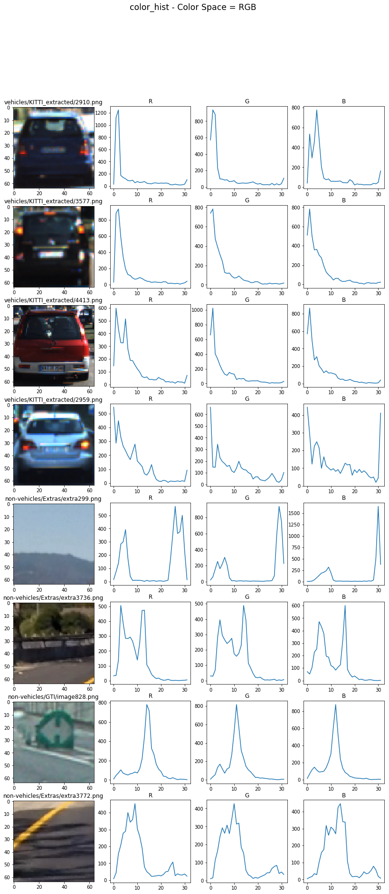
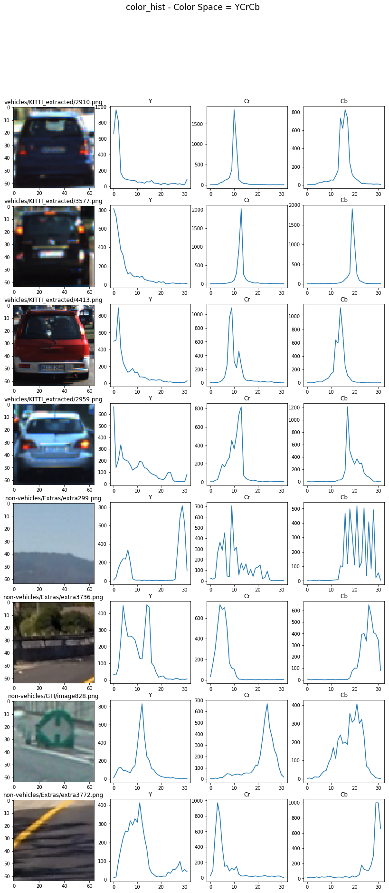
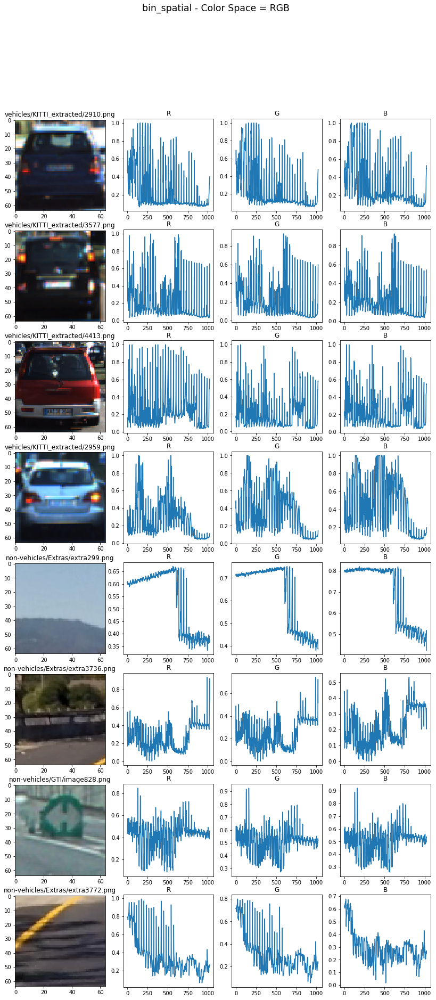
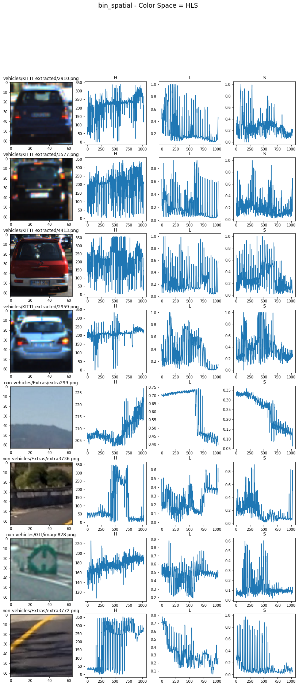
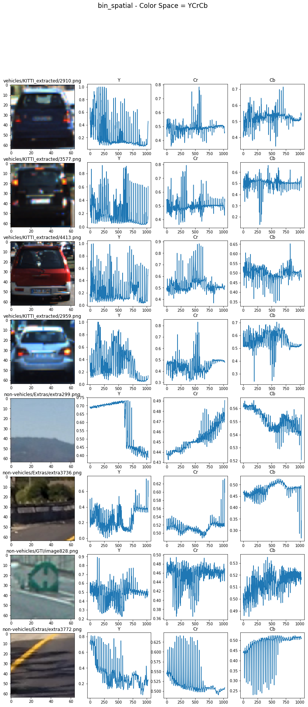
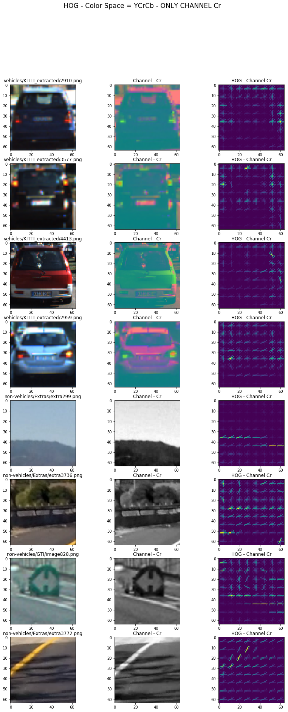
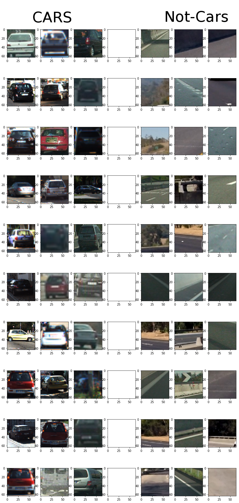
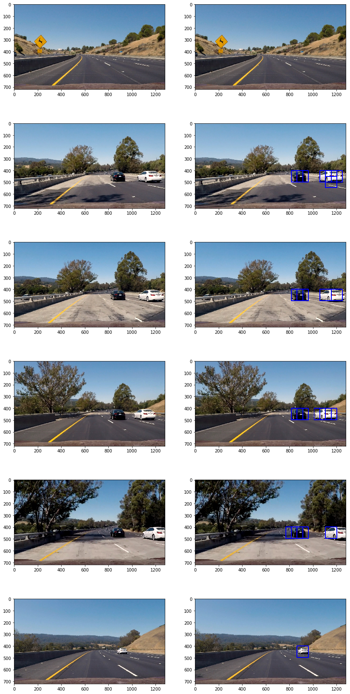
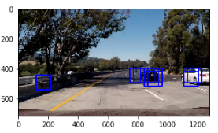
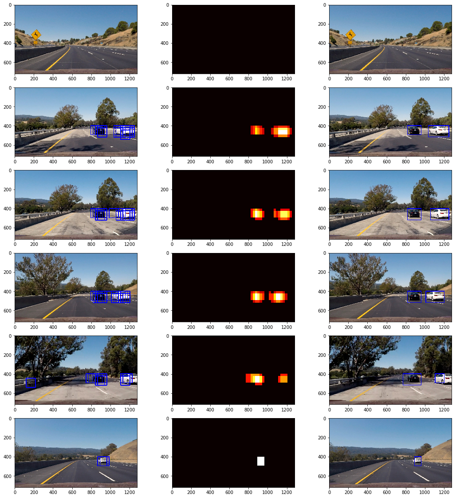

# Self Driving Car Nanodegree - Vehicle Detection 
### by Thomas Wieczorek - 06.03.2017
[](http://www.udacity.com/drive)


Project Overview
---

The goal of this project is to write a software pipeline to identify vehicles in a video from a front-facing camera on a car. 

The steps of this project are the following:

1. Generating Features
  1. Color Tranform Histogram
  2. Binned Color Feature
  3. Histogram of Oriented Gradients (HOG) feature 
  4. Summary on the used Features
2. Training a classifier to distinguish between Cars and Non-Cars
  1. Training data
  2. Support Vector Machine (SVM)
  3. Optimizing Feature-Parameter
3. Implement a sliding-window technique and use the trained classifier to search for vehicles in images.
  1. Detection and classification through Sliding Windows
  2. Improving the result by using Heatmaps
  3. Application of the pipeline for videos
4. Results in a Video
5. Furhter Improvements:

---
## 1. Generating Features

To train a classifier to detect vehicles, well defined input-features are required. One very easy way is to simply use the pixel values of a picture. However, especially with traditional Machine Learning classifier like Support-Vector Machines, the results are suboptimal.

A better approach to achieve good features is by generating them with different algorithms and combining all features.

###  i. Color Transform Histogram

The code for Color Transform Histogram can be found in `vehicle_detection.ipynb`. 

Exact Template matching (every pixel is identical) is not a promising approach, because every car looks different in a frame. However, we can use some patterns that are indicate cars.

One pattern is brightly colored car paint. The colors between cars may vary, but often the colors are mostly vibrant compared to the street or bushes.

The function `color_hist` takes an image and a bin size and returns three concatenated histograms for every color chanel:
```python
def color_hist(img, nbins=32):
    # Compute the histogram of the color channels separately
    channel1_hist = np.histogram(img[:,:,0], bins=nbins)
    channel2_hist = np.histogram(img[:,:,1], bins=nbins)
    channel3_hist = np.histogram(img[:,:,2], bins=nbins)
    # Concatenate the histograms into a single feature vector
    hist_features = np.concatenate((channel1_hist[0], channel2_hist[0], channel3_hist[0]))
    # Return the individual histograms, bin_centers and feature vector
    return hist_features
```

The function `plot_colorhistogram` takes a color space as input and plots the resulting histograms (however it plots them as charts, because patterns are easier visible) for every color channel. 

```python
def plot_colorhistogram(color=None, title_a='R', title_b='G', title_c='B', function='color_hist'):
    f, ax = plt.subplots(2*EXAMPLE_SIZE, 4, figsize=(14,30))
    f.suptitle(function + ' - Color Space = ' + title_a + title_b + title_c , fontsize='xx-large')

    #cars_indicies = random.sample(range(0, len(cars)), EXAMPLE_SIZE)
    for i, index in enumerate(cars_indicies):
        example_car = mpimg.imread(cars[index])
        if color is not None:
            example_car_color = cv2.cvtColor(example_car, color)
        else:
            example_car_color = example_car
        
        if function == 'color_hist':
            c_hist = color_hist(example_car_color,nbins=32)
        else:
            c_hist = bin_spatial(example_car_color)
            
        color_size = (int)(c_hist.shape[0]/3)
        a = c_hist[0:color_size]
        b = c_hist[color_size:2*color_size]
        c = c_hist[2*color_size:3*color_size]
        ax[i][0].imshow(example_car)
        ax[i][0].set_title(cars[index][16:])
        
        ax[i][1].plot(a)
        ax[i][2].plot(b)
        ax[i][3].plot(c)
        
        ax[i][1].set_title(title_a)
        ax[i][2].set_title(title_b)
        ax[i][3].set_title(title_c)
```

The result for **Color Transform Histogram** for four car images and four non-car images for **RGB-colorspace**:



Some patterns are visible for the human eye. However the color space *RGB* has some deficits, because it will always be different for every vehicle color. Other color spaces like *HLS* or *YCrCb* could be better.
* https://en.wikipedia.org/wiki/RGB_color_model
* https://en.wikipedia.org/wiki/HSL_and_HSV
* https://en.wikipedia.org/wiki/YCbCr

The result for **Color Transform Histogram** for four car images and four non-car images for **HLS-colorspace**:


The result for **Color Transform Histogram** for four car images and four non-car images for **YCrCb-colorspace**:



The patterns are way more distinguishable with *HLS* or *YCrCb*, than with *RGB*. 

**The final decision was made on the YCrCb-Colorspace.**

###  ii. Spatial Binned Color Feature

The code for Color Transform Histogram can be found in `vehicle_detection.ipynb`. 

Instead of using a histogram, another approach is to Spatial Bin the color Features. 

```python
def bin_spatial(img, size=(32, 32)):
    color1 = cv2.resize(img[:,:,0], size).ravel()
    color2 = cv2.resize(img[:,:,1], size).ravel()
    color3 = cv2.resize(img[:,:,2], size).ravel()
    return np.hstack((color1, color2, color3))
```

Using the function `plot_colorhistogram` again, the results are also very useful. 

The result for *Spatial Binned Color Feature* for four car images and four non-car images for *RGB-colorspace*:



The result for **Spatial Binned Color Feature** for four car images and four non-car images for **HLS-colorspace**:



The result for **Spatial Binned Color Feature** for four car images and four non-car images for **YCrCb-colorspace**:



**The final decision was made again on the YCrCb-Colorspace.**

###  iii. Histogram of Oriented Gradients (HOG) feature 

*"The histogram of oriented gradients (HOG) is a feature descriptor used in computer vision and image processing for the purpose of object detection. The technique counts occurrences of gradient orientation in localized portions of an image."* Source: [Wikipedia - Histogram_of_oriented_gradients](https://en.wikipedia.org/wiki/Histogram_of_oriented_gradients)

The code for HOG can be found in `vehicle_detection.ipynb`. The function `get_hog_features` returns the Histogram of Oriented Gradients. 

```python
def get_hog_features(img, orient, pix_per_cell, cell_per_block, 
                        vis=False, feature_vec=False):
    # Call with two outputs if vis==True
    if vis == True:
        features, hog_image = hog(img, orientations=orient, 
                                  pixels_per_cell=(pix_per_cell, pix_per_cell),
                                  cells_per_block=(cell_per_block, cell_per_block), 
                                  transform_sqrt=False, 
                                  visualise=vis, feature_vector=feature_vec)
        return features, hog_image
    # Otherwise call with one output
    else:      
        features = hog(img, orientations=orient, 
                       pixels_per_cell=(pix_per_cell, pix_per_cell),
                       cells_per_block=(cell_per_block, cell_per_block), 
                       transform_sqrt=False, 
                       visualise=vis, feature_vector=feature_vec)
        return features
```
The parameters were set on:

* ORIENT = 6
* PIX_PER_CELLS = 8
* CELL_PER_BLOCK = 2
* _(The reason for this values are explained in chapter 2.iii)_

The result for **Histogram of Oriented Gradients (HOG)** for four car images and four non-car images for each of the **YCrCb-colorspace**:





###  iv. Summary on the used Features

In the function `find_cars`, all features from i, ii and iii are merged into one long feature vector. The relevant code parts for the feature vector are:

```python
def find_cars(img, ystart, ystop, scale, svc, X_scaler, orient, pix_per_cell, cell_per_block, spatial_size, hist_bins):

#[...]

ctrans_tosearch = convert_color(img_tosearch, conv='RGB2YCrCb')
ch1 = ctrans_tosearch[:,:,0]
ch2 = ctrans_tosearch[:,:,1]
ch3 = ctrans_tosearch[:,:,2]

#[...]

# Compute individual channel HOG features for the entire image
hog1 = get_hog_features(ch1, orient, pix_per_cell, cell_per_block, feature_vec=False)
hog2 = get_hog_features(ch2, orient, pix_per_cell, cell_per_block, feature_vec=False)
hog3 = get_hog_features(ch3, orient, pix_per_cell, cell_per_block, feature_vec=False)

for xb in range(nxsteps):
    for yb in range(nysteps):
        ypos = yb*cells_per_step
        xpos = xb*cells_per_step
        # Extract HOG for this patch
        hog_feat1 = hog1[ypos:ypos+nblocks_per_window, xpos:xpos+nblocks_per_window].ravel() 
        hog_feat2 = hog2[ypos:ypos+nblocks_per_window, xpos:xpos+nblocks_per_window].ravel() 
        hog_feat3 = hog3[ypos:ypos+nblocks_per_window, xpos:xpos+nblocks_per_window].ravel() 
        hog_features = np.hstack((hog_feat1, hog_feat2, hog_feat3))

        xleft = xpos*pix_per_cell
        ytop = ypos*pix_per_cell

        # Extract the image patch
        subimg = cv2.resize(ctrans_tosearch[ytop:ytop+window, xleft:xleft+window], (64,64))

        # Get color features
        spatial_features = bin_spatial(subimg, size=spatial_size)
        hist_features = color_hist(subimg, nbins=hist_bins)

        test_features = X_scaler.transform(np.hstack((spatial_features, hist_features, hog_features)).reshape(1, -1))    

```

---
## 2. Training a classifier to distinguish between Cars and Non-Cars

###  i. Training data
Having the a long and useful feature vector is the foundation for the next step: classification. Using [Support Vector Machines](https://en.wikipedia.org/wiki/Support_vector_machine) the input vector is used to distinguish cars from not cars.

To train the classifier a given training set was used, consisting of [8792 Car-Images](https://s3.amazonaws.com/udacity-sdc/Vehicle_Tracking/vehicles.zip) and [8968 Non-Car-Images](https://s3.amazonaws.com/udacity-sdc/Vehicle_Tracking/non-vehicles.zip). All images are .png and have a size of 64x64px. Here are some examples of the training data:



The training data was split into Training (66%) and Test(33%) data with:
```python
X_train, X_test, y_train, y_test = train_test_split(scaled_X, y, test_size=0.33, random_state=41)
```

###  ii. Support Vector Machine (SVM)

Support Vector Machine is used to classify cars from non-cars. Support Vector Machines are useful for image classification like these. Another good approach would to use Convolutional Neural Networks (Deep Learning). 

```python
svr = svm.SVC()
svr.fit(X_train, y_train)
print('Test Accuracy of SVC = ', round(svr.score(X_test, y_test), 4))
```

###  iii. Optimizing Feature-Parameter
In the file `optimize_parameter.ipynb`, the following parameters were tested:
* SPATIAL_BIN
* HIST_BINS  
* ORIENT 
* PIX_PER_CELLS  
* CELL_PER_BLOCK 

I tried one parameter after another and chose the best one. A better approach would be to combine all possible parameter-constellation.


```python
for SPATIAL_BIN in param_SPATIAL_BIN:
    for HIST_BINS in param_HIST_BINS:
        for ORIENT in param_ORIENT:
            for PIX_PER_CELLS in param_PIX_PER_CELLS:
                for CELL_PER_BLOCK in param_CELL_PER_BLOCK:
                    X_train, X_test, y_train, y_test = feature_all('YCrCb', SPATIAL_BIN, HIST_BINS, ORIENT, PIX_PER_CELLS, CELL_PER_BLOCK)
                    svr = svm.SVC()
                    svr.fit(X_train, y_train)
                    print('****Parameter:******\n' +
                          'SPATIAL_BIN = {} \nHIST_BINS = {} \nORIENT = {} \nPIX_PER_CELLS = {} \nCELL_PER_BLOCK = {} '.format(SPATIAL_BIN, HIST_BINS, ORIENT, PIX_PER_CELLS, CELL_PER_BLOCK))
                    print('Test Accuracy of SVC = ', round(svr.score(X_test, y_test), 4))
```


| Parameter        | Score         |
| ---------------- |:-------------:|
| SPATIAL_BIN=8    | 0.9939        | Best!
| SPATIAL_BIN=16   | 0.9924        |

| Parameter        | Score         |
| ---------------- |:-------------:|
| HIST_BINS=8      | 0.9909        |
| HIST_BINS=16     | 0.9924        | 
| HIST_BINS=32     | 0.9909        |
| HIST_BINS=64     | 0.9924        | Best!

| Parameter        | Score         |
| ---------------- |:-------------:|
| ORIENT=2         | 0.9803        |
| ORIENT=4         | 0.9909        | 
| ORIENT=6         | 0.9909        |
| ORIENT=8         | 0.9924        | Best!

| Parameter        | Score         |
| ---------------- |:-------------:|
| PIX_PER_CELLS=2  | 0.9773        |
| PIX_PER_CELLS=4  | 0.9848        |
| PIX_PER_CELLS=8  | 0.9909        | Best!
| PIX_PER_CELLS=16 | 0.9909        |
| PIX_PER_CELLS=32 | 0.9788        | 

| Parameter        | Score         |
| ---------------- |:-------------:|
| CELL_PER_BLOCK=1 | 0.9848        |
| CELL_PER_BLOCK=2 | 0.9909        | Best!
| CELL_PER_BLOCK=4 | 0.9909        | 
| CELL_PER_BLOCK=6 | 0.9879        |


*Final Parameters:*
* SPATIAL_BIN = 8
* HIST_BINS= 64
* ORIENT = 8
* PIX_PER_CELLS = 8
* CELL_PER_BLOCK = 2


###  iv. Optimizing Hyperparameter

Using [sklearn-Grid-Search](http://scikit-learn.org/stable/modules/grid_search.html), I optimized the Hyperparameter of the Support Vector Machine.

```python
X_train, X_test, y_train, y_test = feature_all('YCrCb', SPATIAL_BIN, HIST_BINS, ORIENT, PIX_PER_CELLS, CELL_PER_BLOCK)

parameters = [{'kernel': ['rbf'], 'gamma': [1e-3, 1e-4],
                     'C': [1, 10, 100, 1000]},
                    {'kernel': ['linear'], 'C': [1, 10, 100, 1000]}]

svr = svm.SVC()
clf = GridSearchCV(svr, parameters)

clf.fit(X_train, y_train)
```

**The Result:**
```python
Best parameters set found on development set:

{'kernel': 'rbf', 'gamma': 0.0001, 'C': 10}

Grid scores on development set:

0.914 (+/-0.019) for {'kernel': 'rbf', 'gamma': 0.001, 'C': 1}
0.987 (+/-0.012) for {'kernel': 'rbf', 'gamma': 0.0001, 'C': 1}
0.917 (+/-0.019) for {'kernel': 'rbf', 'gamma': 0.001, 'C': 10}
0.991 (+/-0.005) for {'kernel': 'rbf', 'gamma': 0.0001, 'C': 10}
0.917 (+/-0.019) for {'kernel': 'rbf', 'gamma': 0.001, 'C': 100}
0.991 (+/-0.005) for {'kernel': 'rbf', 'gamma': 0.0001, 'C': 100}
0.917 (+/-0.019) for {'kernel': 'rbf', 'gamma': 0.001, 'C': 1000}
0.991 (+/-0.005) for {'kernel': 'rbf', 'gamma': 0.0001, 'C': 1000}
0.989 (+/-0.003) for {'kernel': 'linear', 'C': 1}
0.989 (+/-0.003) for {'kernel': 'linear', 'C': 10}
0.989 (+/-0.003) for {'kernel': 'linear', 'C': 100}
0.989 (+/-0.003) for {'kernel': 'linear', 'C': 1000}
```

---
## 3. Implement a sliding-window technique and use the trained classifier to search for vehicles in images

### i. Detection and classification through Sliding Windows

The classifcation is built on Support Vector Machine and the 3 described feature-vectors 1) bin_spatial, 2) color_hist and 3) hog_feat for every channel. The function `find_cars` takes this trained classificator and the tuned parameters and returns an image with drawn rectangles around detected vehicles, as well as the windows coordinates.

The function is based on a overlapping sliding window technique with a fixed size, which is scrolling through the picture. The size as well as other parameters were tuned by trial-and-error.

The Feature Vectors are extracted from these patches and fed into the SVM-classificator. 

```python
def find_cars(img, ystart, ystop, scale, svc, X_scaler, orient, pix_per_cell, cell_per_block, spatial_size, hist_bins, hot_windows):

    draw_img = np.copy(img)
    img = img.astype(np.float32)/255
    
    img_tosearch = img[ystart:ystop,:,:]
    ctrans_tosearch = convert_color(img_tosearch, conv='RGB2YCrCb')
    if scale != 1:
        imshape = ctrans_tosearch.shape
        ctrans_tosearch = cv2.resize(ctrans_tosearch, (np.int(imshape[1]/scale), np.int(imshape[0]/scale)))

    ch1 = ctrans_tosearch[:,:,0]
    ch2 = ctrans_tosearch[:,:,1]
    ch3 = ctrans_tosearch[:,:,2]

    # Define blocks and steps as above
    nxblocks = (ch1.shape[1] // pix_per_cell)-1
    nyblocks = (ch1.shape[0] // pix_per_cell)-1 
    nfeat_per_block = orient*cell_per_block**2
    
    # 64 was the orginal sampling rate, with 8 cells and 8 pix per cell
    window = 64
    nblocks_per_window = (window // pix_per_cell)-1 
    cells_per_step = 2  # Instead of overlap, define how many cells to step
    nxsteps = (nxblocks - nblocks_per_window) // cells_per_step
    nysteps = (nyblocks - nblocks_per_window) // cells_per_step

    # Compute individual channel HOG features for the entire image
    hog1 = get_hog_features(ch1, orient, pix_per_cell, cell_per_block, feature_vec=False)
    hog2 = get_hog_features(ch2, orient, pix_per_cell, cell_per_block, feature_vec=False)
    hog3 = get_hog_features(ch3, orient, pix_per_cell, cell_per_block, feature_vec=False)
 
    for xb in range(nxsteps):
        for yb in range(nysteps):
            ypos = yb*cells_per_step
            xpos = xb*cells_per_step
            # Extract HOG for this patch
            hog_feat1 = hog1[ypos:ypos+nblocks_per_window, xpos:xpos+nblocks_per_window].ravel() 
            hog_feat2 = hog2[ypos:ypos+nblocks_per_window, xpos:xpos+nblocks_per_window].ravel() 
            hog_feat3 = hog3[ypos:ypos+nblocks_per_window, xpos:xpos+nblocks_per_window].ravel() 
            hog_features = np.hstack((hog_feat1, hog_feat2, hog_feat3))

            xleft = xpos*pix_per_cell
            ytop = ypos*pix_per_cell

            # Extract the image patch
            subimg = cv2.resize(ctrans_tosearch[ytop:ytop+window, xleft:xleft+window], (64,64))

            # Get color features
            spatial_features = bin_spatial(subimg, size=spatial_size)
            hist_features = color_hist(subimg, nbins=hist_bins)

            # Scale features and make a prediction
            test_features = X_scaler.transform(np.hstack((spatial_features, hist_features, hog_features)).reshape(1, -1))    
            #test_features = X_scaler.transform(np.hstack((spatial_features, hist_features, hog_features)))
            find_Before_Scaler = np.hstack((spatial_features, hist_features, hog_features))

            test_prediction = svc.predict(test_features)

            if test_prediction == 1:
                xbox_left = np.int(xleft*scale)
                ytop_draw = np.int(ytop*scale)
                win_draw = np.int(window*scale)
                top_left = (xbox_left, ytop_draw+ystart)
                down_right = (xbox_left+win_draw,ytop_draw+win_draw+ystart)
                cv2.rectangle(draw_img, top_left , down_right, (0,0,255),6) 
                
                # Assuming each "box" takes the form ((x1, y1), (x2, y2))
                hot_windows.append((top_left, down_right))

    return draw_img, hot_windows
```


**The result:**




### ii. Improving the result by using Heatmaps

The result from `find_cars` is suboptimal: Although the parameters were tuned for the Support Vector Machine, the image contains some False Positive and Duplicate Detections. A False Positive can be seen in the following image on the left side, several Duplicate Detections are over the cars on the right side of the image:



To reduce these problems, a heatmap is used. For every detection the heat map will be added "heat" (+=1). Because a single car contains several positive detections, there will be a "Hot Spot". By using a threshold, cars can be distinguished by noise. Another benefit are tight rectangles around the cars.

Using the [label function from scipy](https://docs.scipy.org/doc/scipy-0.16.0/reference/generated/scipy.ndimage.measurements.label.html), single hotspots will be grouped and labeled. Through this we can make distinctions between single cars.

*The result from the heat map:*


As we can see in the second to the last image, False Positives and the Duplicate Detections can be effectively reduced by using Heatmaps.

### iii. Application of the pipeline for videos

The whole pipeline is applied on every image of a video by using the function `find_vehicles_in_video`:

```python
def find_vehicles_in_video(image):
    hot_windows = []

    image_classified, hot_windows = find_cars(img=image,ystart=YSTART,ystop=YSTOP, scale=SCALE, svc=svc, X_scaler=X_scaler, orient=ORIENT, 
                      pix_per_cell=PIX_PER_CELLS,cell_per_block=CELL_PER_BLOCK, spatial_size=(SPATIAL_BIN, SPATIAL_BIN), hist_bins=HIST_BINS, hot_windows=hot_windows)
    
    
    heat = np.zeros_like(image[:,:,0]).astype(np.float)
    heat = add_heat(heat,hot_windows)

    # Apply threshold to help remove false positives
    heat = apply_threshold(heat,1)

    # Visualize the heatmap when displaying    
    heatmap = np.clip(heat, 0, 255)

    # Find final boxes from heatmap using label function
    labels = label(heatmap)
    draw_img = draw_labeled_bboxes(np.copy(image), labels)
    
    return draw_img    

#Reading the video image by image and detect and classify vehicles
output0 = 'output_test_video.mp4'
clip0 = VideoFileClip("test_video.mp4")
output_clip0 = clip0.fl_image(find_vehicles_in_video) 
%time output_clip0.write_videofile(output0, audio=False)
```


## 4. Results in a video


**The resulting video**:


[](https://www.youtube.com/watch?v=rWJBPTzSW2k)


## 5. Discussion and further improvements:
The system could fail by having a lot of shadows or high contrast light. Not learned vehicles like trucks or bikes will probably fail, too. 

To improve the system, the following measures could be taken into account:
- Using the mean of rectangles over several images, a smoother result could be achieved
- By further improving the input feature and parameters the system could gain in stability
- Deep learning such as Convolutional Neural Networks could possibly be highly better than Support Vector Machine, however they are also have higher resource requirements.
- Instead of using a fixed window size, the detection could be also improved. Vehicles in the vertical center of a video appear smaller because they are further away. On the other side, the closer a car, the bigger it appears. By using different window sizes the system could take account of this phenomenon.